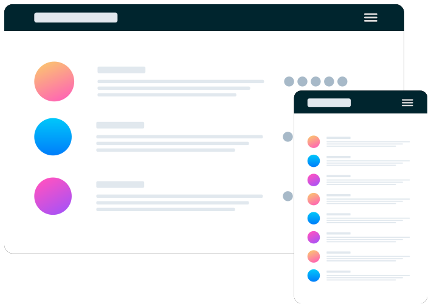

# Frontend Mentor - Huddle landing page with single introductory section solution

This is a solution to the [Huddle landing page with single introductory section challenge on Frontend Mentor](https://www.frontendmentor.io/challenges/huddle-landing-page-with-a-single-introductory-section-B_2Wvxgi0). Frontend Mentor challenges help you improve your coding skills by building realistic projects. 

## Table of contents

- [Overview](#overview)
  - [The challenge](#the-challenge)
  - [Screenshot](#screenshot)
  - [Links](#links)
- [My process](#my-process)
  - [Built with](#built-with)
  - [What I learned](#what-i-learned)
  - [Main Features Implemented](#main-features-implemented)
  - [Continued development](#continued-development)
  - [Useful resources](#useful-resources)
- [Author](#author)
- [Acknowledgments](#acknowledgments)

This project consists of creating a responsive landing page for Huddle, a platform focused on building communities.

The main objective was to replicate the provided design, implementing the page with a mobile-first architecture to ensure an optimized user experience across all devices.

## Overview

### The challenge

Users should be able to:

- View the optimal layout for the page depending on their device's screen size
- See hover states for all interactive elements on the page

### Screenshot


### Links

- Solution URL: [Add solution URL here](https://eneasdutra.github.io/huddle-landing-page/)

## My process

### Built with

- Semantic HTML5 markup
- CSS custom properties
- Flexbox
- Mobile-first workflow

### What I learned

During this challenge, I consolidated some important concepts:

1. HTML5: Semantic structure of the content.

2. CSS3: Styling and layout, including the Mobile-First approach with the use of Media Queries for adaptation to larger screens (Desktop).

3. Font Awesome: Used for the social icons in the footer.

4. Google Fonts: Used for Poppins (titles) and Open Sans (body text).

### 🎯 Main Features Implemented

- Responsive Layout: The page transitions from a single-column layout (Mobile) to a two-column layout (Desktop).
- Interactive States (:hover / :focus): Implementation of active and focus states for the Register button and social icons, as per design specifications.
- Clean Design: Focus on clarity and fidelity to the Huddle design system (typography, colors, and spacing).

To see how you can add code snippets, see below:

```html
<header class="logo-and-illustration">
  
  <div class="illustration-container">
    
  </div>
</header>
```
```css
.logo-and-illustration {
    text-align: left;
}
.logo {
    max-width: 120px;
    margin-bottom: 4rem;
}
.illustration-container {
    margin-bottom: 2rem;
}
```
### Continued development

Planned improvements:
- Add subtle entrance and hover animations.
- Implement the same layout using React Components.
- Apply BEM methodology to standardize CSS class naming.

### Useful resources

- 🧱 Guia de CSS – MDN
- 🎨 Frontend Mentor Style Guide
- 📘 The Markdown Guide
- ⚙️ CSS Tricks – Complete Guide to Flexbox  

## Author

- Github - [eneasdutra](https://github.com/eneasdutra)
- Frontend Mentor - [@eneasdutra](https://www.frontendmentor.io/profile/eneasdutra)
- LinkedIn - [@eneasmdutra](https://www.linkedin.com/in/eneasmdutra/)  [](https://www.linkedin.com/in/eneasmdutra/)

## Acknowledgments

I am grateful to the Frontend Mentor community for the inspiration, feedback, and constant support.
Each challenge is a new opportunity to evolve as a learner in front-end development.
